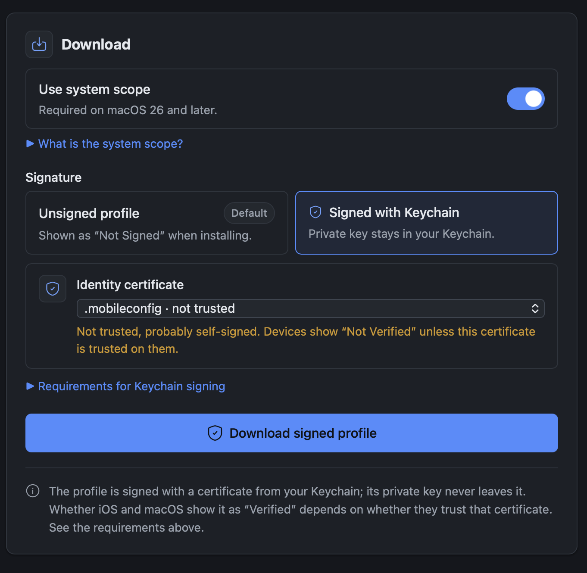

# Apple DNS Profile Creator

A small website that generates encrypted-DNS (DoH and DoT) configuration
profiles for iOS and macOS. Everything happens in the browser. Nothing is
uploaded anywhere, and the tool works fully offline, which makes it suitable for
hosting on a home network.

**[Try it out](https://tofulupo.github.io/apple-dns-profile-creator/)** - no
install, no sign-up, nothing leaves your device.

Apple has supported DNS-over-HTTPS and DNS-over-TLS since iOS 14 and macOS 11,
but exposes no way to use them without an app or a configuration profile. This
tool builds those profiles.

## Which way to run it

| You want to                           | Use                     | Notes                              |
| ------------------------------------- | ----------------------- | ---------------------------------- |
| Install a profile on an iPhone / iPad | LAN server/github pages | The device must download it itself |
| Install a profile on a Mac            | Desktop app (macOS)     | Saves and opens System Settings    |
| Host it for your household/company    | `dist/` on any server   | Static files, no runtime needed    |
| Work on the code                      | `deno task dev`         | Rebuilds on save                   |

## first steps

### check out the code

```sh
git clone git@github.com:tofulupo/apple-dns-profile-creator.git
```

### Tasks to run

> [!NOTE]
> Requires [Deno](https://deno.com) 2.9 or newer.

```sh
deno task dev              # build, watch and serve on the LAN
deno task build            # production bundle into dist/
deno task preview          # build once, then serve
deno task desktop          # build, then package the macOS app into build/

deno task check            # type-check + lint + fmt --check + test
deno task test             # test suite only
deno fmt                   # format

deno task fixtures:fetch   # (re)download upstream .mobileconfig test fixtures
deno task fixtures:lint    # validate fixtures with Apple's plutil (macOS only)
```

### local development

```sh
deno task dev                      # http://localhost:5173, also on the LAN
DNS_TOOL_PORT=8080 deno task dev   # different port
```

`dev` builds `dist/`, serves it, and rebuilds whenever anything in `src/`,
`css/`, `pages/`, `public/` or `deno.json` changes. There is no hot reload;
refresh the page. Edits to `pages/pages.ts` itself need a restart.

### Tests

```sh
deno task test             # the suite
deno task check            # type-check + lint + fmt --check + the suite
deno task fixtures:fetch   # required once, for the Mullvad-dependent tests
```

Expected behaviour is derived from Apple's payload documentation and from real
profiles known to install on devices.

Test fixtures are genuine profiles from upstream projects. The paulmillr
profiles are public domain and committed here; the Mullvad profiles carry no
license, so they are fetched on demand and the cases that use them contribute
nothing until you run `deno task fixtures:fetch`.

`test/golden/` holds the exact profiles the builder produced for every committed
fixture. A failure there means generated profiles changed, which is a change to
what users install: review the diff and update the files deliberately, rather
than regenerating them to make the suite pass.

On macOS the suite additionally pipes generated profiles through Apple's own
`plutil`. The `check` workflow runs on both Ubuntu and macOS for every push and
pull request, so that leg is covered in CI.

### Architecture

```sh
src/lib/       pure core - no dependencies, no DOM
  xml.ts         minimal XML reader for the plist subset
  plist.ts       Apple property list build + parse
  dnssettings.ts DnsConfig -> DNSSettings dictionary
  ondemand.ts    DnsConfig -> OnDemandRules array
  profile.ts     DnsConfig[] -> configuration profile
  import.ts      .mobileconfig -> DnsConfig[]
  addresses.ts   resolver address filtering
  validate.ts    IP validation, list parsing
  types.ts       domain types
  mod.ts         public surface

src/ui/        browser layer - DOM wiring only, no profile semantics
  tool.ts        entry point for pages/index.html
  profile.ts     entry point for pages/finalize.html
  storage.ts     localStorage-backed configuration store
  theme.ts       header theme switch: system, light or dark
  download.ts    Blob download, or the desktop binding when present
  signing.ts     desktop-only Signature choice on the profile page
  dropzone.ts    drag and drop onto either page's zone, reading the file
  dom.ts         typed DOM helpers

pages/         HTML sources
  pages.ts       page table: nav order, descriptions, entry modules, sitemap
  _layout.html   shared shell: head, header, tabs, footer
  index.html     <main> content of the tool page
  finalize.html  <main> content of the profile page

scripts/       build and dev server
  build.ts       render pages into the layout, deno bundle -> dist/, sitemap
  serve.ts       static file server, --watch rebuilds

src/desktop/   macOS app helpers, used by desktop.ts
  bindings.ts    the bindings' types, shared with src/ui/
  save.ts        save to a folder without overwriting
  signing.ts     Keychain signing through macOS's `security` tool
  certificate.ts Subject Key Identifier from a DER certificate
  window_state.ts  remembered window size

desktop.ts     deno desktop entry point: serves dist/, saves via a binding
public/        copied verbatim into the build, names unchanged
```

> [!NOTE]
> `dnssettings.ts` and `ondemand.ts` are split out because Apple defines both
> structures identically for the `.mobileconfig` payload and for the **iOS 27**
> `com.apple.configuration.network.dns-settings` declaration.

## the app

### Pages

| File            | Purpose                                                         |
| --------------- | --------------------------------------------------------------- |
| `index.html`    | The tool: upload an existing profile, or enter settings by hand |
| `finalize.html` | Profile view: review the collected configurations and download  |

Each page is only its `<main>` content in `pages/`. The build renders it into
`pages/_layout.html`, filling in the description, the tab bar and the version
from `deno.json`. To add a page, add a fragment to `pages/` and an entry to
`PAGES` in `pages/pages.ts`. The tabs and `sitemap.xml` follow automatically.

### Excluded domains vs. limited domains

Two fields under **Advanced** both take a list of domains, and they are
opposites rather than duplicates.

| Field                | Effect                                                                |
| -------------------- | --------------------------------------------------------------------- |
| **Excluded domains** | A deny list. Encrypted DNS is used everywhere _except_ these domains. |
| **Limit to domains** | An allow list. Encrypted DNS is used _only_ for these domains.        |

Leaving both empty - **the default** - sends every query through the encrypted
resolver, which is usually what you want.

> [!NOTE]
> "Limit to domains" is for split DNS, where an internal resolver should answer
> for one zone and the network's own resolver for everything else. A single
> leading `*` is allowed, so `*.example.com` and `example.com` both match
> `mail.example.com`.

Under the hood they are different mechanisms: exclusions become `OnDemandRules`
that switch the resolver off, while the limit becomes `SupplementalMatchDomains`
inside `DNSSettings`. Setting both is legal but rarely useful.

### Running on a LAN

```sh
deno task preview
```

Browse to `http://<your-machine-ip>:5173`, configure the profile, and download
it. iOS (Safari) recognises the media type and offers to install; if it saves
the file instead, opening it from Files should start the same flow.

For a permanent install, `deno task build` produces a static `dist/` that any
web server can host, over HTTP or HTTPS. Nothing server-side is required.

### GitHub Pages

The `pages` workflow publishes `dist/` on every push to `main`.

A hosted instance stays entirely client-side - nothing is uploaded.

> [!NOTE]
> The profiles it produces are **unsigned**, so iOS and macOS label them "Not
> Signed" during installation and ask for confirmation. The download page states
> this.

### Desktop app

```sh
deno task desktop
```

Packages `dist/` and a small Deno server into a macOS application,
`build/DNS Profile Creator.app`, using
[`deno desktop`](https://docs.deno.com/runtime/desktop/) - about 66 MB, with the
system's own webview. The server listens on a private `127.0.0.1` port only.

**Download profile** saves straight to `~/Downloads`, never over an existing
file (`encrypted-dns 2.mobileconfig` and so on), then offers to open it, which
hands it to System Settings for installation. The window remembers its size,
stored in `~/Library/Application Support/local.encrypted-dns.tool/`.

Only macOS is built for now: a `.mobileconfig` can only be installed on Apple
devices.

#### Signing with the Keychain

In the desktop app the Download panel offers **Signed with Keychain**: pick a
certificate that has its private key in your Keychain, and the profile is saved
as `encrypted-dns-signed.mobileconfig`, signed through macOS's own `security`
tool. The key never leaves the Keychain; the first time, macOS asks whether
`security` may use it. Expired certificates are not listed.



Devices show a signed profile as "Verified" only if they trust the certificate's
issuer. A self-signed certificate shows as "Not Verified" unless it is installed
and trusted on each device.

**The bundle is only ad-hoc signed**, which is fine locally but not
distributable. Set `desktop.macos.codesignIdentity` in `deno.json` to a
Developer ID to produce something notarizable.

### Profile signing

Profiles from the website are **not** signed; the desktop app can sign them with
a Keychain certificate (see above). An unsigned profile installs identically;
iOS and macOS just label it "Not Signed" during installation. Signing changes
that label and adds tamper protection, nothing else. To sign a downloaded
profile yourself:

#### Create a self-signed signing certificate

- Open Keychain Access (in /Applications/Utilities/)
- In the menu bar: Keychain Access → Certificate Assistant → Create
  Certificate...
- Fill in:
  - Name: e.g. MDM Signing Cert (remember this — you'll use it as the signing
    identity)
  - Identity Type: Self-Signed Root
  - Certificate Type: Code Signing
  - Check "Let me override defaults" if you want to extend the validity period
    (default is ~1 year; 10 years is common for this)
- Click Continue through the prompts (you can skip entering an email address)
- When done, the certificate is created directly in your login keychain — no
  separate import needed

### HTTP or HTTPS

**Plain HTTP is fine.** The one API that would have required https,
`crypto.randomUUID()`, is wrapped in [`src/lib/uuid.ts`](src/lib/uuid.ts), which
falls back to `crypto.getRandomValues()`

To serve the dev or preview server over TLS, set both variables:

```sh
DNS_TOOL_TLS_CERT=/path/cert.pem DNS_TOOL_TLS_KEY=/path/key.pem deno task dev
```

> [!NOTE]
> Setting only one is an error rather than a silent fallback to HTTP. For a real
> deployment, terminating TLS at a reverse proxy

### Configuration

Application settings live in [`src/config.ts`](src/config.ts) as typed
constants. The version shown in the header is `version` in
[`deno.json`](deno.json), injected at build time.

The **Quick presets** on the tool page are `presets` in the same file: up to six
providers, each a name, protocol and server. `test/config.test.ts` fails the
suite if there are more than six, if names repeat, or if a server would not pass
the form's own check.

| Variable            | Effect                                 |
| ------------------- | -------------------------------------- |
| `DNS_TOOL_PORT`     | Dev/preview server port (default 5173) |
| `DNS_TOOL_TLS_CERT` | PEM certificate path - enables HTTPS   |
| `DNS_TOOL_TLS_KEY`  | PEM private key path - enables HTTPS   |

Desktop packaging settings (name, icons, identifier, output paths, signing) live
in the `desktop` block of [`deno.json`](deno.json).

## History and thanks

This started as a fork of [fyr77/dns-mobileconfig][upstream] and has since been
substantially rewritten: the core was rebuilt as a tested TypeScript library,
cookies were replaced with `localStorage`, the external signing service was
removed.

- Paul Miller for [his article](https://paulmillr.com/posts/encrypted-dns/) and
  his [premade profiles](https://github.com/paulmillr/encrypted-dns), which the
  test suite uses as fixtures
- [Mullvad](https://github.com/mullvad/encrypted-dns-profiles) for their
  published profiles
- [Reicon](https://reicon.dev) for the server, shield, receipt, sun, moon,
  monitor, download and info icons in `public/icons/` (MIT, see
  `public/icons/LICENSE-reicon.txt`)

[upstream]: https://code.diluvian.cc/fyr77/dns-mobileconfig

## Disclaimer

No warranty or liability is provided on the generated files. Use at your own
risk.
