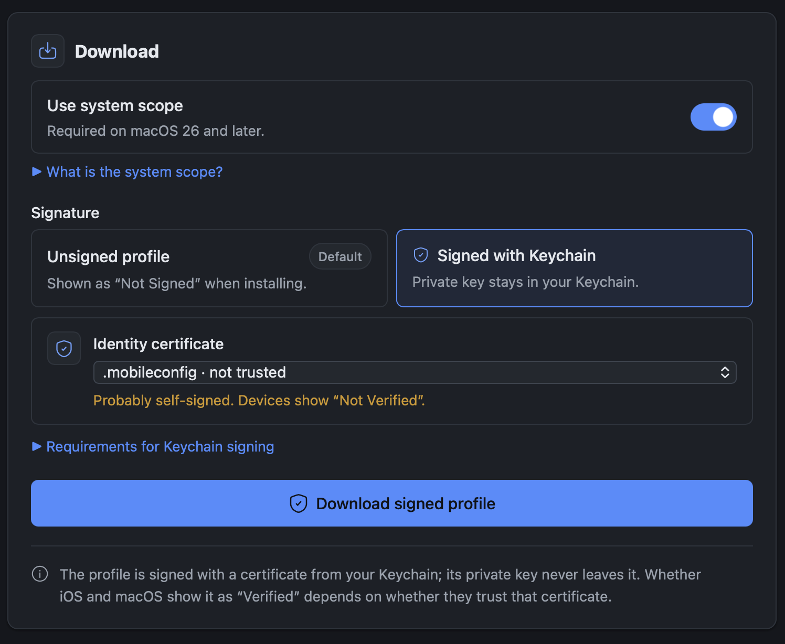

# Apple DNS Profile Creator

A small website that generates encrypted-DNS (DoH and DoT) configuration
profiles for iOS and macOS. Everything happens in the browser. Nothing is
uploaded anywhere, and the tool works fully offline, which makes it suitable for
hosting on a home network.

**[Try it out](https://apple.mobileconfig.deno.net)** - no install, no sign-up,
nothing leaves your device.

Apple has supported DNS over HTTPS and DNS over TLS since iOS 14 and macOS 11,
but exposes no way to use them without an app or a configuration profile. This
tool builds those profiles.

> [!NOTE]
> The profile is **unsigned**, iOS and macOS reports "Not Signed" and will ask
> for confirmation. Use the [Desktop app](#desktop-app) for local signing.

## First steps

### check out the code

```sh
git clone git@github.com:tofulupo/apple-dns-profile-creator.git
```

### Tasks to run

> [!NOTE]
> Requires [Deno](https://deno.com) 2.9 or newer. The desktop app also needs
> [Rust](https://rustup.rs) and Xcode 26 or newer.

```sh
deno task dev              # build, watch and serve on the LAN
deno task build            # production bundle into dist/
deno task preview          # build once, then serve
deno task desktop          # build, then package the macOS app with Tauri
deno task desktop:dev      # build, then run the app without packaging it
deno task desktop:icon     # regenerate the app's icon files after editing the icon

deno task check            # type-check + lint + fmt --check + all tests
deno task test             # all tests: the site's and the desktop app's
deno task test:web         # the site's tests only (Deno)
deno task test:desktop     # the desktop app's tests only (Rust)
deno fmt                   # format


deno task fixtures:fetch   # (re)download upstream .mobileconfig test fixtures
deno task fixtures:lint    # validate fixtures with Apple's plutil (macOS only)
```

### local development

```sh
deno task dev                      # http://localhost:5173, also on the LAN
DNS_TOOL_PORT=8080 deno task dev   # different port
```

`dev` builds `dist/`, serves it, and rebuilds whenever anything in `src/`,
`css/`, `pages/`, `public/` or `deno.json` changes. There is no hot reload;
refresh the page. Edits to `pages/pages.ts` itself need a restart.

### Tests

```sh
deno task test             # the suite: Deno tests, then the app's Rust tests
deno task check            # type-check + lint + fmt --check + the suite
deno task fixtures:fetch   # required once, for the Mullvad-dependent tests
```

The desktop app's tests live next to its code in `src-tauri/src/`, as Rust
`#[cfg(test)]` modules; `deno task test:desktop` builds `dist/` first, since the
app embeds it.

Expected behaviour is derived from Apple's payload documentation and from real
profiles known to install on devices.

Test fixtures are genuine profiles from upstream projects. The paulmillr
profiles are public domain and committed here; the Mullvad profiles carry no
license, so they are fetched on demand and the cases that use them contribute
nothing until you run `deno task fixtures:fetch`.

`test/golden/` holds the exact profiles the builder produced for every committed
fixture. A failure there means generated profiles changed, which is a change to
what users install: review the diff and update the files deliberately, rather
than regenerating them to make the suite pass.

On macOS the suite additionally pipes generated profiles through Apple's own
`plutil`. The `check` workflow runs on both Ubuntu and macOS for every push and
pull request, so that leg is covered in CI.

### Architecture

```sh
src/lib/       pure core - no dependencies, no DOM
  xml.ts         minimal XML reader for the plist subset
  plist.ts       Apple property list build + parse
  dnssettings.ts DnsConfig -> DNSSettings dictionary
  ondemand.ts    DnsConfig -> OnDemandRules array
  profile.ts     DnsConfig[] -> configuration profile
  import.ts      .mobileconfig -> DnsConfig[]
  addresses.ts   resolver address filtering
  validate.ts    IP validation, list parsing
  types.ts       domain types
  mod.ts         public surface

src/ui/        browser layer - DOM wiring only, no profile semantics
  tool.ts        entry point for pages/index.html
  profile.ts     entry point for pages/finalize.html
  storage.ts     localStorage-backed configuration store
  theme.ts       header theme switch: system, light or dark
  download.ts    Blob download, or the desktop binding when present
  signing.ts     desktop-only Signature choice on the profile page
  dropzone.ts    drag and drop onto either page's zone, reading the file
  dialogs.ts     confirm() and alert(), native in the desktop app
  page_ready.ts  tells the desktop app to show its window
  desktop.ts     the desktop app's commands, as bindings
  dom.ts         typed DOM helpers

pages/         HTML sources
  pages.ts       page table: nav order, descriptions, entry modules,
                 SITE_URL (the deployed address)
  _layout.html   shared shell: head, header, tabs
  index.html     <main> content of the tool page
  finalize.html  <main> content of the profile page
  llms.txt       template for dist/llms.txt; {{ site }} becomes SITE_URL

scripts/       build, dev server, app icon and fonts
  build.ts       render pages into the layout, deno bundle -> dist/,
                 sitemap.xml, robots.txt and llms.txt from SITE_URL
  serve.ts       static file server, --watch rebuilds
  server.ts      the website on Deno Deploy: dist/ with caching,
                 compression and security headers (CSP by script hash)
  app_icon.ts    AppIcon.png and src-tauri/icons/ from desktop/AppIcon.icon
  fonts.ts       fonts/source/ -> Latin-only fonts/subset/

src/desktop/
  bindings.ts    the desktop app's commands as the pages call them

src-tauri/     macOS app (Tauri 2): shows dist/ in a native window
  tauri.conf.json    window, bundle, icon and signing settings
  src/lib.rs         the commands the pages call, window and app setup
  src/save.rs        save to a folder without overwriting
  src/signing.rs     Keychain signing through macOS's `security` tool
  src/certificate.rs Subject Key Identifier from a DER certificate
  src/window_size.rs remembered window size
  src/dialog.rs      native alerts, for the pages and the commands

desktop/       macOS app icon: AppIcon.icon (light + dark), AppIcon.png fallback
public/        copied verbatim into the build, names unchanged
```

> [!NOTE]
> `dnssettings.ts` and `ondemand.ts` are split out because Apple defines both
> structures identically for the `.mobileconfig` payload and for the **iOS 27**
> `com.apple.configuration.network.dns-settings` declaration.

## The app

### Pages

| File            | Purpose                                                         |
| --------------- | --------------------------------------------------------------- |
| `index.html`    | The tool: upload an existing profile, or enter settings by hand |
| `finalize.html` | Profile view: review the collected configurations and download  |

Each page is only its `<main>` content in `pages/`. The build renders it into
`pages/_layout.html`, filling in the description, the tab bar and the version
from `deno.json`. To add a page, add a fragment to `pages/` and an entry to
`PAGES` in `pages/pages.ts`. The tabs and `sitemap.xml` follow automatically.

### Skip encrypted DNS for vs. use encrypted DNS only for

The **Domains** row under **Behavior & rules** has two fields that both take a
list of domains. They are opposites rather than duplicates, and neither blocks
anything: the domains they leave out go to the network's own DNS.

| Field                          | Effect                                                                |
| ------------------------------ | --------------------------------------------------------------------- |
| **Skip encrypted DNS for**     | A deny list. Encrypted DNS is used everywhere _except_ these domains. |
| **Use encrypted DNS only for** | An allow list. Encrypted DNS is used _only_ for these domains.        |

Leaving both empty - **the default** - sends every query through the encrypted
resolver, which is usually what you want.

> [!NOTE]
> "Use encrypted DNS only for" is for split DNS, where an internal resolver
> should answer for one zone and the network's own resolver for everything else.
> A single leading `*` is allowed, so `*.example.com` and `example.com` both
> match `mail.example.com`.

Under the hood they are different mechanisms: exclusions become `OnDemandRules`
that switch the resolver off, while the limit becomes `SupplementalMatchDomains`
inside `DNSSettings`. Setting both is legal but rarely useful.

### Running on a LAN

```sh
deno task preview
```

Browse to `http://<your-machine-ip>:5173`, configure the profile, and download
it. iOS (Safari) recognises the media type and offers to install; if it saves
the file instead, opening it from Files should start the same flow.

For a permanent install, `deno task build` produces a static `dist/` that any
web server can host, over HTTP or HTTPS. Nothing server-side is required.

### Desktop app

```sh
deno task desktop
```

Packages `dist/` into a macOS application,
`src-tauri/target/release/bundle/macos/DNS Profile Creator.app`, using
[Tauri 2](https://tauri.app) - about 7 MB, with the system's own webview. The
pages load from inside the app; nothing listens on the network.

**Download profile** saves straight to `~/Downloads`, never over an existing
file (`encrypted-dns 2.mobileconfig` and so on), then offers to open it, which
hands it to System Settings for installation. The window remembers its size,
stored in `~/Library/Application Support/local.encrypted-dns.tool/`. The icon
follows light and dark mode on macOS 26 and later.

Versions up to 3.7.4 were built with
[`deno desktop`](https://docs.deno.com/runtime/desktop/); the `deno-desktop` tag
marks the last of them.

Only macOS is built for now: a `.mobileconfig` can only be installed on Apple
devices.

#### Signing with the Keychain

In the desktop app the Download panel offers **Signed with Keychain**: pick a
certificate that has its private key in your Keychain, and the profile is saved
as `encrypted-dns-signed.mobileconfig`, signed through macOS's own `security`
tool. The key never leaves the Keychain; the first time, macOS asks whether
`security` may use it. Expired certificates are not listed.



Devices show a signed profile as "Verified" only if they trust the certificate's
issuer. A self-signed certificate shows as "Not Verified" unless it is installed
and trusted on each device.

**The bundle is only ad-hoc signed**, which is fine locally but not
distributable. Set `bundle.macOS.signingIdentity` in
[`src-tauri/tauri.conf.json`](src-tauri/tauri.conf.json) to a Developer ID to
produce something notarizable.

### Profile signing

Profiles from the website are **not** signed; the desktop app can sign them with
a Keychain certificate (see above). An unsigned profile installs identically;
iOS and macOS just label it "Not Signed" during installation. Signing changes
that label and adds tamper protection, nothing else. To sign a downloaded
profile yourself:

#### Create a self-signed signing certificate

- Open Keychain Access (in /Applications/Utilities/)
- In the menu bar: Keychain Access → Certificate Assistant → Create
  Certificate...
- Fill in:
  - Name: e.g. MDM Signing Cert (remember this, you'll use it as the signing
    identity)
  - Identity Type: Self-Signed Root
  - Certificate Type: Code Signing
  - Check "Let me override defaults" if you want to extend the validity period
    (default is ~1 year; 10 years is common for this)
- Click Continue through the prompts (you can skip entering an email address)
- When done, the certificate is created directly in your login keychain, no
  separate import needed

### HTTP or HTTPS

**Plain HTTP is fine.** The one API that would have required https,
`crypto.randomUUID()`, is wrapped in [`src/lib/uuid.ts`](src/lib/uuid.ts), which
falls back to `crypto.getRandomValues()`

To serve the dev or preview server over TLS, set both variables:

```sh
DNS_TOOL_TLS_CERT=/path/cert.pem DNS_TOOL_TLS_KEY=/path/key.pem deno task dev
```

> [!NOTE]
> Setting only one is an error rather than a silent fallback to HTTP. For a real
> deployment, terminating TLS at a reverse proxy

### Configuration

Application settings live in [`src/config.ts`](src/config.ts) as typed
constants. The version shown in the header is `version` in
[`deno.json`](deno.json), injected at build time.

The **Quick presets** on the tool page are `presets` in the same file: up to six
providers, each a name, protocol and server, plus optional `serverAddresses`
(the provider's resolver IPs, filled into the form so one click gives a complete
profile). `test/config.test.ts` fails the suite if there are more than six, if
names repeat, if a server would not pass the form's own check, or if an address
is not a valid IP or appears twice.

| Variable            | Effect                                 |
| ------------------- | -------------------------------------- |
| `DNS_TOOL_PORT`     | Dev/preview server port (default 5173) |
| `DNS_TOOL_TLS_CERT` | PEM certificate path - enables HTTPS   |
| `DNS_TOOL_TLS_KEY`  | PEM private key path - enables HTTPS   |

Desktop app settings (name, identifier, window, icons, signing) live in
[`src-tauri/tauri.conf.json`](src-tauri/tauri.conf.json); its version comes from
`deno.json` too.

## History and thanks

This started as a fork of [fyr77/dns-mobileconfig][upstream] and has since been
substantially rewritten: the core was rebuilt as a tested TypeScript library,
cookies were replaced with `localStorage`, the external signing service was
removed.

- Paul Miller for [his article](https://paulmillr.com/posts/encrypted-dns/) and
  his [premade profiles](https://github.com/paulmillr/encrypted-dns), which the
  test suite uses as fixtures
- [Mullvad](https://github.com/mullvad/encrypted-dns-profiles) for their
  published profiles
- [Reicon](https://reicon.dev) for the server, shield, receipt, sun, moon,
  monitor, download, info and card-remove icons in `public/icons/` (MIT, see
  `public/icons/LICENSE-reicon.txt`)
- [flag-icons](https://github.com/lipis/flag-icons) for the country flags in the
  presets menu, in `flags/` (MIT, see `flags/LICENSE-flag-icons.txt`)

[upstream]: https://code.diluvian.cc/fyr77/dns-mobileconfig

## Disclaimer

No warranty or liability is provided on the generated files. Use at your own
risk.
